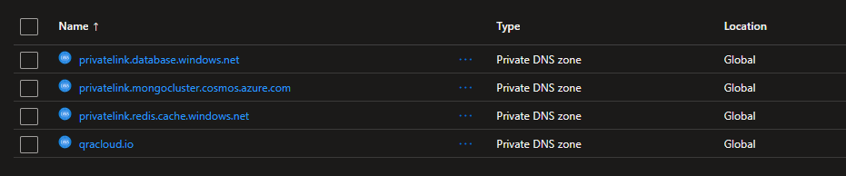

# Overview

The QRA Cloud platform is delivered as a marketplace application that provisions and configures the cloud infrastructure required to host our solution in your environment.

The deployment creates and configures all necessary cloud resources, including:

- Kubernetes service
- Networking components
- Monitoring and supporting infrastructure

During deployment, customers can choose between:

1. **Bring Your Own AKS (BYO Kubernetes cluster)**
2. **Deploy a New AKS Cluster (Recommended)**

This document explains both options and their requirements.

## Deployment Options (Azure)

This section provides information on various deployment options available for the Azure platform. The QRA Cloud platform is deployed as an Azure Managed application.

## Option 1 - Deploy a new to a managed AKS Cluster (Recommended)

If you do **not** bring your own AKS cluster, the marketplace deployment will:

- Provision a new Kubernetes cluster
- Configure it according to platform requirements
- Apply required networking and security settings
- Install required Kubernetes components
- Configure ingress, scaling, and platform dependencies

### Advantages

- Fully automated deployment
- Pre-configured to meet platform standards
- No manual Kubernetes configuration required
- Simpler support model
- Reduced risk of misconfiguration

### Recommended For

- Customers without an existing AKS standard
- Customers wanting a turnkey deployment
- Customers prioritizing simplicity and supportability

## Option 2 Bring Your Own AKS (BYO AKS)

Customers may choose to use an existing AKS cluster.

⚠️ **Important:**\
Because Azure Managed Applications deploy resources into a managed resource group, the deployment context don't have enough permissions to write resources outside of the mrg.
Due to this limitation, additional configuration steps are required.

### BYO AKS Requirements

If you choose to bring your own AKS, you must ensure the following prerequisites are met.

#### AKS Cluster Requirements

- Kubernetes version 1.32.9 and up
- Node pool
  - Mode: User
  - OS: Linux
  - Autscaling: enabled
  - VM size: We recommend `F series v6` such as `Standard_F4als_v6` vm images
  - Node labels
    - qracloud.io/workload: 'qra'
- Keda scaler is enabled

#### Networking Requirements

- Virtual network
  - Address space of at least /16
  - Subnets must be configured
    - qraSystem - x.x.1.0/24
    - qraApp - x.x.2.0/24
    - qraDb - x.x.3.0/26
    - qraSql - x.x.4.0/26
    - qraRedis - x.x.5.0/27
- Load balacned ingress is enabled. See [required kubernetes components](#required-kubernetes-components). Take note of the ingress IP.

#### Required Kubernetes Components

You must pre-install the following components:

- Ingress controller - used for ingress

```bash
helm upgrade --install ingress-nginx ingress-nginx/ingress-nginx \
    --namespace ingress-nginx \
    --create-namespace \
    --set controller.service.type=LoadBalancer \
    --set controller.service.externalTrafficPolicy=Local \
    --set controller.service.annotations."service\.beta\.kubernetes\.io/azure-load-balancer-internal"=true \
    --set controller.service.annotations."service\.beta\.kubernetes\.io/azure-load-balancer-internal-subnet"=<your system node pool subnet name> \
    --wait \
    --timeout 300s
```

- cert-manager - used for tls cert

```bash
helm upgrade cert-manager oci://quay.io/jetstack/charts/cert-manager \
    --install \
    --version v1.19.2 \
    --namespace cert-manager \
    --create-namespace \
    --set crds.enabled=true \
    --set "extraArgs={--dns01-recursive-nameservers=ns1-06.azure-dns.com:53\,ns2-06.azure-dns.net:53\,ns3-35.azure-dns.org:53\,ns4-35.azure-dns.info:53\,8.8.8.8:53}" \
    --server-side --force-conflicts
  ```

- Keda scaler - used for scaling pods
  
 ```bash
helm upgrade --install keda kedacore/keda \
    --namespace keda \
    --create-namespace \
    --wait \
    --timeout 5m
 ```

- QRA Cloud chart files
  
```bash
helm upgrade qracloud oci://$REGISTRY_NAME/helm/qracloud/platform/qra \
    --install \
    --namespace qra --create-namespace \
    --set global.registry.name=$REGISTRY_NAME \
    --set global.registry.username=$REGISTRY_USERNAME \
    --set global.registry.password=$REGISTRY_PASSWORD \
    --set global.database.username=$DB_USERNAME \
    --set global.database.password=$DB_PASSWORD \
    --set keycloak.adminUser=$KC_ADMIN_USERNAME \
    --set keycloak.adminPassword=$KC_ADMIN_PASSWORD \
    --set global.tenantName="${TENANT_NAME}" \
    --set global.tenantAdmin=$TENANT_ADMINISTRATORS \
    --set infrastructure.telemetry.appInsights.connectionString="${APPINSIGHTS_CONNECTION_STRING}" \
    --set global.azureDNS.clientSecret=$TLS_SECRET \
    --set global.database.connectionString="${QRA_DB_CONNECTIONSTRING}" \
    --set global.keycloak.connectionString="${QRA_KC_DB_CONNECTIONSTRING}" \
    --set global.redis.connectionString="${QRA_REDIS_CONNECTIONSTRING}" \
    --set global.nodePool=$QRA_NODE_POOL \
    --set global.qwl.replicas=$QWL_REPLICAS \
    --wait
```

> A list of credentials and values will be provided separately in order to configure your deployment during marketplace installation.

## Identity & Permissions

The following permissions must be configured:

- AKS must allow workload identity or managed identity (if required)
- The platform must have sufficient RBAC permissions to:
  - Create namespaces
  - Deploy workloads
  - Create services and ingress resources
  - Create secrets and config maps

## Namespace & Isolation

The platform will be deployed into the `qra` namespace. You must ensure that the said namespace is not yet taken or have any conflicts with your policies.

## Post installation steps

After marketplace deployment, there are steps that needs to be done to fully setup the deployment.

### Vnet connection

Our solution uses its own vnet to configure its infrastructure, and in order for your organization to access it, you are required to do some form of connection to the provided vnet via vnet peering, vpn gateway, etc. We recommend `vnet peering` for its simplicity.

### DNS zone virtual network link

Our solution provides a DNS zone which makes the domains such as `qracloud.io` and other PaaS services domain available. Vnets can resolve the domain until it is linked to the DNS zone.

#### Managed Kubernetes

For managed kubernetes, you must link your vnet to the `qracloud.io` DNS zone.

#### BYO AKS

For BYO AKS, the following needs to be linked to all private DNS zones created by the deployment.



## Recommendation

We strongly recommend deploying a **new AKS cluster through the Managed
Application** unless:

- You have strict infrastructure standards
- You require consolidation into an existing AKS cluster
- You have Kubernetes operational expertise

Using a managed AKS deployment ensures:

- Faster onboarding
- Reduced configuration risk

> If you need assistance evaluating which option is best for your environment, please contact our [technical team](mailto:support@qracorp.com) before initiating deployment.
